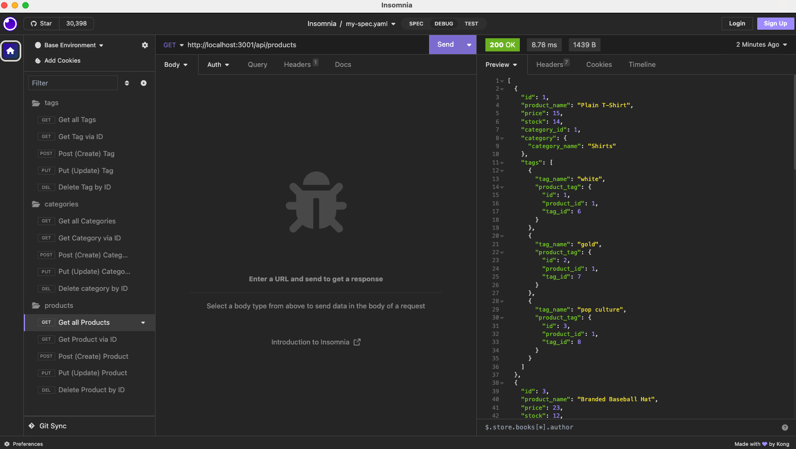
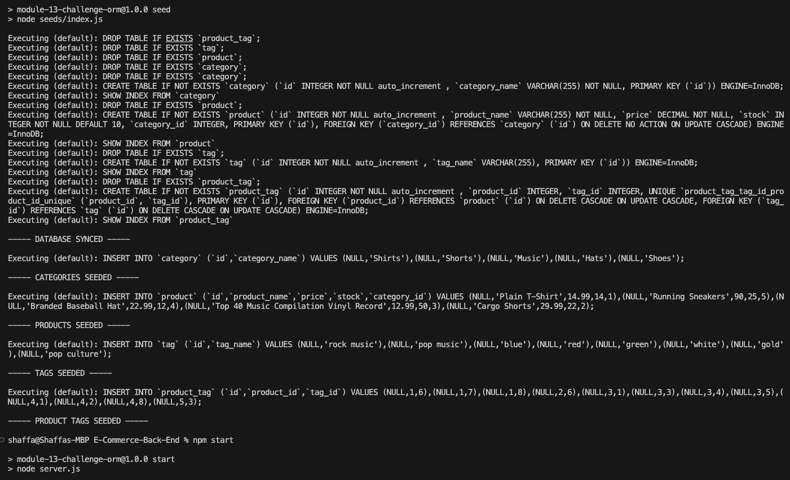

# E-Commerce-Back-End
An app with back end for an e-commerce site utilizing Object-Relational Mapping (ORM)

## GITHUB REPO
https://github.com/shaffachaudhry/E-Commerce-Back-End
## WALKTHROUGH 
https://drive.google.com/file/d/1sC86mV-EDOp9Riy6kHXjZYMyxouroSJO/view

## MOCK IMAGE

## Table of Contents
- [Table of Contents](#table-of-contents)
- [Description](#description)
- [Usage](#usage)
- [Mock Image](#mock-image)
- [Installation](#installation)
- [License](#license)
- [Contributors](#contributors)
- [Tests](#tests)
- [Questions](#questions)

## Description
The application provides a back end for an e-commerce website that uses a functional Express.js API to manage a database. 

## Mock Image

## Usage 
This application uses Insomnia to test routes (GET/POST/PUT/DELETE)

## Installation 
The user  must clone the repository onto their local drive. Install dependencies using `npm i`. Initialize MySQL shell and `source db/schema.sql` followed by `use ecommerce_db`. Once completed run `npm run seed` followed by `npm start`. Use Insomina to test each route. 

## License 
This project is covered under the MIT license.

## Contributors
I am the sole contributor of this project. However, this project was built with the help of in class modules, specifically the Student Mini Project. Additional links that were helpful linked below: 
https://www.geeksforgeeks.org/mongodb-findone-method/
https://stackoverflow.com/questions/40168478/find-and-findone-methods-in-mongodb-showing-different-results

## Tests 
N/A

## Questions 
For any additional questions or information, please contact me, additionally, feel free to view my other projects: 
- Github: [shaffachaudhry](https://github.com/shaffachaudhry)
